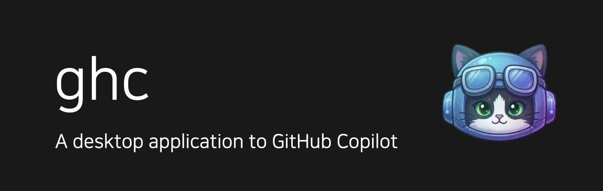
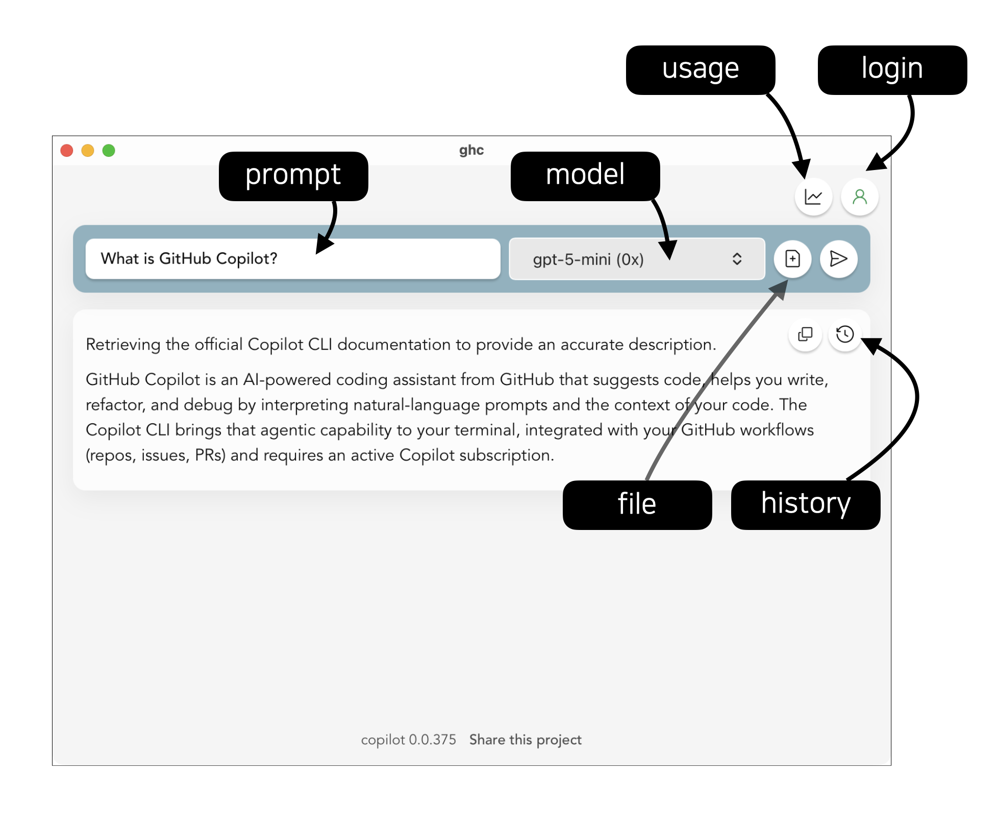
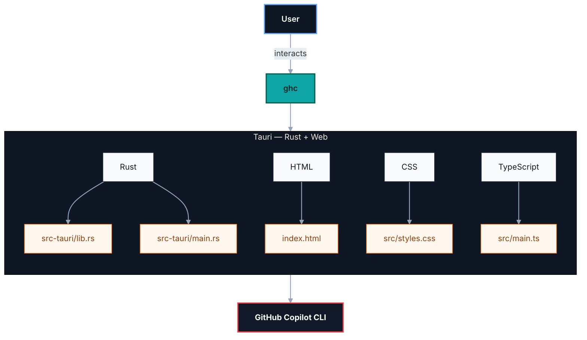

# ghc - GitHub Copilot CLI Desktop Application

## Description

Use GitHub Copilot CLI with a desktop application.

## Features

- Automatic Install of GitHub Copilot CLI
- GitHub Authentication

- Various AI Model
- Usage check

- File as context
- Export Response as clipboard
- Chat History

## Architectures

## Installation

## Pre-requisites

- GitHub Account with Copliot enabled, Education account is recommended.
